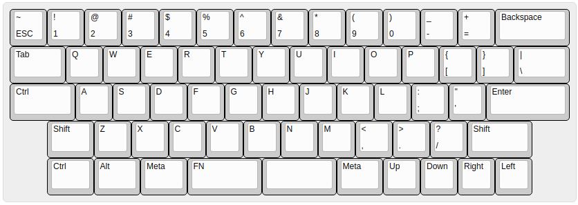

# r60 #

Seems like all the cool kids are making their own keyboards, this one
is mine.  Hopefully this makes me cool.

Like most, it's a 16MHz Atmega32U4 running the [quantum mechanical
keyboard](https://github.com/qmk/qmk_firmware) firmware.

This is a 60% keyboard, and I am trying to make it fit in generic 60%
cases like the poker case or the WASD Code-61 case (which is nice and
heavy -- I like it quite a bit).

Key layout is a bit odd, but is for more metas closer to the thumb
but without going into crazy planck type zones.

The 2u spacebars are going to be tough to find, though.

Note well that I have not actually built this yet, so I don't know
that it works.

Layouts and plates in the layouts directory, and I'll link
pcb on oshpark when I get one made.
